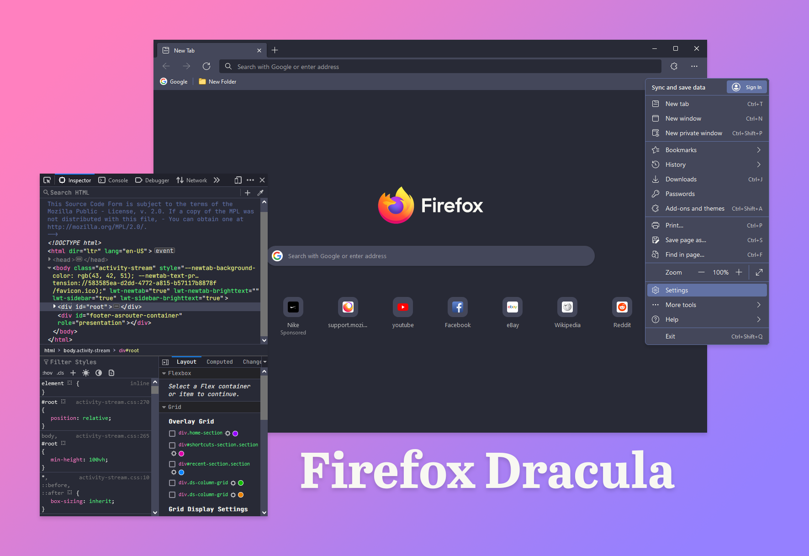
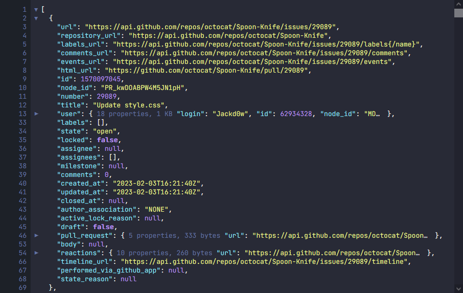
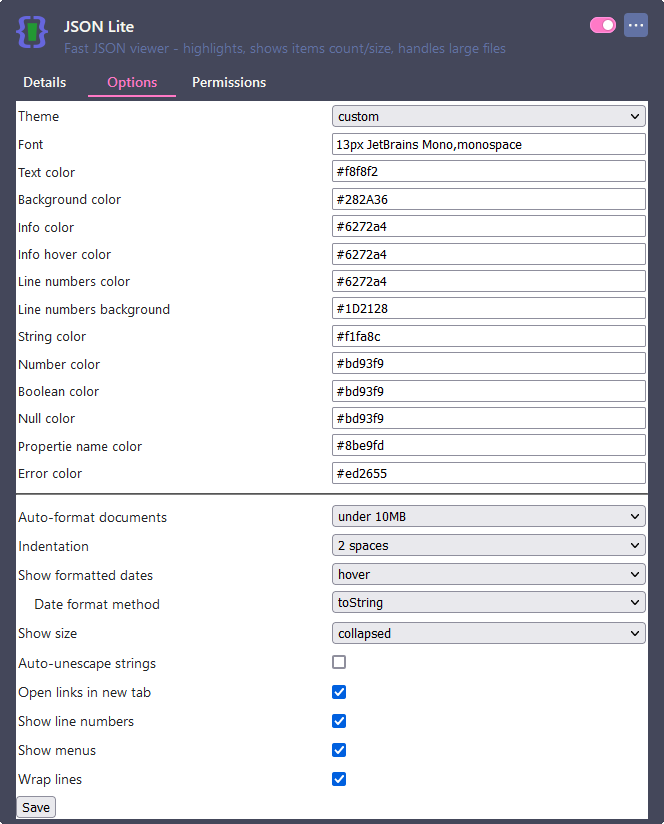

# Firefox Dracula

This Firefox userChrome.css and userContent.css theme is a fork of [Edge-Frfox](https://github.com/bmFtZQ/edge-frfox) that aims to recreate the look and feel of the Chromium version of [Microsoft Edge](https://www.microsoft.com/edge) in the style of [Dracula](https://draculatheme.com/).

**[Extra Features](#-extra-features) • [Installation](#️-installation) • [JSON Viewer](#-json-viewer) • [Tweaks](#-tweaks) • [License](#-license)**



## 💫 Extra Features

- Custom DevTools
- Custom [JSON Viewer](#-json-viewer)

## ⚙️ Installation

1. Go to `about:support` and click the "Open Folder/Show in Finder" button for the root directory of your browser profile/s.
2. Download and copy the `chrome` folder into the profile folder.
3. Go to `about:config` and change these preferences:

   ### For all operating systems:
   1. `toolkit.legacyUserProfileCustomizations.stylesheets` = `true`
   2. `svg.context-properties.content.enabled` = `true`
   3. `layout.css.color-mix.enabled` = `true`

   ### On macOS:
   1. To use the Edge style context menu on macOS then set `widget.macos.native-context-menus` = `false`

   ### Recommended:
   1. `browser.tabs.tabMinWidth` = `66`
   2. `browser.tabs.tabClipWidth` = `86`
   3. `browser.tabs.tabmanager.enabled` = `false`

## 📜 JSON Viewer

| Preview                       | Settings                                        |
|-------------------------------|-------------------------------------------------|
|  |  |

### Installation

1. Go to `about:config` page and set `devtools.jsonview.enabled` = `false`.
2. Install the JSON Lite extension from [here](https://addons.mozilla.org/en-US/firefox/addon/json-lite/).
3. Set the values as shown in the screenshot above, you can find the values to copy below.

   ```yaml
   Font: 13px JetBrains Mono,monospace
   Text color: #f8f8f2
   Background color: #282A36
   Info color: #6272a4
   Info hover color: #6272a4
   Line numbers color: #6272a4
   Line numbers background: #1D2128
   String color: #f1fa8c
   Number color: #bd93f9
   Boolean color: #bd93f9
   Null color: #bd93f9
   Propertie name color: #8be9fd
   Error color: #ed2655
   ```

## 🎨 Tweaks

Certain tweaks can be applied to the theme, to enable them navigate to `about:config` and create a boolean key for each tweak you want to use and set it to `true`, then restart the browser.

To disable a tweak, set the key to `false` or delete it, then restart the browser.

| use background image on newtab page                                                                |
| -------------------------------------------------------------------------------------------------- |
| **SETUP: Add an image named `background-0.(jpg/png)` to the `chrome` folder.**                     |
| **OPTIONAL: Add a second image named `background-1.(jpg/png)` for seperate dark mode background.** |
| `uc.tweak.newtab-background`                                                                       |

| hide Firefox logo on newtab page |
| -------------------------------- |
| `uc.tweak.hide-newtab-logo`      |

| disable drag space above tabs |
| ----------------------------- |
| `uc.tweak.disable-drag-space` |

| enable Edge style floating tabs |
| ------------------------------- |
| `uc.tweak.floating-tabs`        |

| enable Mica toolbar background *(Windows 11 only)*                  |
| ------------------------------------------------------------------- |
| **See [Mica Tweak Instructions][3] for installation instructions.** |
| **NOTE: Only works on default theme: 'System theme - auto'**        |
| `uc.tweak.win11-mica`                                               |

| force tab background colour to the same colour as the navbar background (useful for Proton themes) |
| -------------------------------------------------------------------------------------------------- |
| **NOTE: can cause readability issues with some themes! (eg. white text on white bg)**              |
| `uc.tweak.force-tab-colour`                                                                        |
|  (Left: OFF, Right: ON)               |

| Show context menu navigation buttons (Back, Forward, Reload, etc.) vertically |
| ----------------------------------------------------------------------------- |
| **NOTE: labels are only shown in the English language.**                      |
| `uc.tweak.vertical-context-navigation`                                        |

| remove tab separators            |
| -------------------------------- |
| `uc.tweak.remove-tab-separators` |

| use Firefox's default context menu font-size (only applies to Windows) |
| ---------------------------------------------------------------------- |
| `uc.tweak.smaller-context-menu-text`                                   |

| disable custom context menus   |
| ------------------------------ |
| `uc.tweak.revert-context-menu` |

| if a tab's close button is hidden, show it when hovering over tab |
| ----------------------------------------------------------------- |
| `uc.tweak.show-tab-close-button-on-hover`                         |

You can also check out [Stylus](https://addons.mozilla.org/en-US/firefox/addon/styl-us/) themes (e.g. [StackOverflow](https://draculatheme.com/stackoverflow) or [GitHub](https://draculatheme.com/github)).

## Mica Tweak Instructions (Windows 11 Only)
1. Download and install [Mica For Everyone][2].
2. Create a custom process rule with the following:
   1. Name: `firefox`
   2. Titlebar Color: `System`
   3. Backdrop Type: `Mica`
3. Enable tweak in `about:config`: `uc.tweak.win11-mica`
4. Restart Firefox.

## 📝 License

[MIT](./LICENSE)
